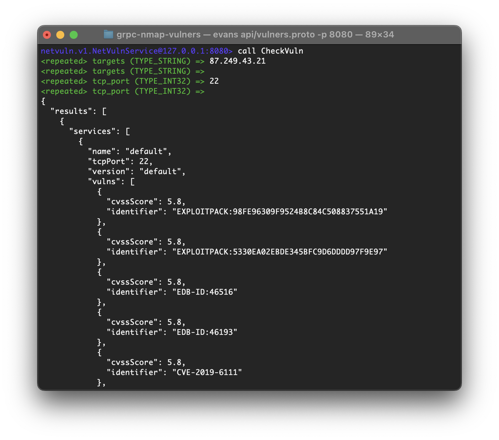

# gRPC nmap vulners
This repository provides you simple gRPC server that scans given targets ports with [nmap-vulners](https://github.com/vulnersCom/nmap-vulners). 
> You must have nmap vulners.nse script installed [(Click)](https://github.com/vulnersCom/nmap-vulners#installation).  

<p align="center">
  
</p>  

## User guide
### Server
1. Add environment variables or add `.env` file.  
    Example `.env` content:  
    ```
    NETWORK="tcp"
    ADDRESS="127.0.0.1:8080"
    ```
2. Run `go mod download` to install all dependecies
3. Run `go build ./cmd/server/...` to build server binary file
4. Run file that you just built (`./server`)

### Client
1. Install [Evans](https://github.com/ktr0731/evans#installation)
2. Run `evans api/vulners.proto -p 8080` from project directory
3. Type `call CheckVuln` and write targets & ports (To stop target or ports input - press `CTRL+D`)

## Development
### Generate Go gRPC files
```console
protoc --go_out=./pkg/ --go_opt=paths=source_relative --go-grpc_out=./pkg/ --go-grpc_opt=paths=source_relative ./api/vulners.proto
```

### Build and run server
```console
go build ./cmd/server/...
./server
```

### Build and run CLI
> test_target: `87.249.43.21`
> test_ports: `22,`
```console
go build ./cmd/cli/...
./cli TARGET PORTS
```